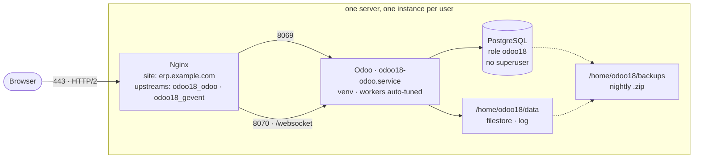

# Odoo Production Toolkit

Takes a fresh Ubuntu server and leaves you with Odoo running under systemd — dedicated system and PostgreSQL users, Python venv, patched wkhtmltopdf, auto-tuned workers, log rotation, firewall. Optionally Nginx with Let's Encrypt, a swap file, and nightly backups. Then keeps it running: update, renew, back up, remove.

**Not** a configuration-management tool. It is a first-run installer plus day-2 commands; it will not reconcile a config you have since edited by hand. It does not install Enterprise, configure mail, or set up replication.

Ubuntu 20.04 / 22.04 / 24.04 · root or sudo · one domain if you want SSL.

## Quick start

```bash
git clone https://github.com/abdalmola-apps/OdooInstallScript.git
cd OdooInstallScript
sudo ./odoo_install.sh
```

Answer the prompts. **Nothing on the system changes until you confirm the summary.**

## The `abo` command

```bash
sudo make install        # -> /usr/local/bin/abo
```

| Command | Does | Script |
|---------|------|--------|
| `abo install` | Provision a new instance | `odoo_install.sh` |
| `abo nginx` | Reverse proxy + Let's Encrypt SSL | `odoo_nginx.sh` |
| `abo backup` | Back up every database an instance owns | `odoo_backup.sh` |
| `abo update` | Pull the latest Odoo source and restart | `odoo_update.sh` |
| `abo ssl` | Certificate status, renew what is due | `odoo_ssl.sh` |
| `abo remove` | Delete an instance and everything it owns | `odoo_remove.sh` |

```bash
sudo abo install -u odoo18 -y
sudo abo nginx  -u odoo18 -d erp.mycompany.com -e admin@mycompany.com
sudo abo backup -u odoo18 -f
sudo abo update -u odoo18
sudo abo ssl
sudo abo remove -u odoo18

abo help · abo <cmd> -h · abo version
```

`abo` is a dispatcher and nothing else — every script still runs directly out of the checkout, so installing is optional. Scripts land in `/usr/local/lib/abo/`; `sudo make uninstall` removes them, `make check` runs shellcheck.

> Named `abo`, not `ab` — `ab` is ApacheBench, and `/usr/local/bin` precedes `/usr/bin`, so it would silently shadow it.

## What you end up with



Everything is namespaced by the system username, which is what makes multiple instances on one box work: `/home/<user>`, `<user>-odoo.conf`, `<user>-odoo.service`, the PostgreSQL role, the logrotate rule, the Nginx upstream names. Run the installer again with a different username — the port is picked for you.

## Installing

| Prompt | Default | Notes |
|--------|---------|-------|
| System username | *required* | Alphanumeric + underscore. Also the key for resume. |
| Odoo version | `18.0` | Menu built live from `odoo/odoo` branches, each labelled runnable or not on **this** server |
| HTTP port | first free pair from `8069` | Both it and the port above must be free |
| Install Nginx? | `no` | Domain + email required if yes; DNS is checked before anything is installed |
| Custom addon Git URLs | *optional* | Comma-separated |
| Swap? | auto (`yes` if RAM < 4 GB) | Size = RAM, capped at 4 GB |
| Daily backups? | `yes` | Then: filestore, retention days, time |

### Express

```bash
sudo ./odoo_install.sh -u odoo18 -y
```

Odoo 18.0, first free port, no Nginx, swap if RAM < 4 GB, backups at 02:00 / 30 days. Flags: `-u` (user), `-y` (all defaults, no confirmation), `-h`.

### Unattended, with Nginx

`-y` cannot do Nginx. Pre-write the answers file instead:

```bash
sudo install -d -m 700 /var/lib/odoo-install
sudo tee /var/lib/odoo-install/odoo18.answers > /dev/null <<'EOF'
OE_VERSION=18.0
OE_PORT=8069
INSTALL_NGINX=yes
OE_DOMAIN=erp.example.com
CERTBOT_EMAIL=admin@example.com
CUSTOM_ADDONS_INPUT=https://github.com/OCA/web.git
SETUP_SWAP=yes
SETUP_BACKUP=yes
BACKUP_FILESTORE=yes
BACKUP_RETENTION=30
BACKUP_HOUR=02:00
EOF
sudo chmod 600 /var/lib/odoo-install/odoo18.answers
```

The file is sourced as root — hence the 700 directory.

### If it is interrupted

State lives in `/var/lib/odoo-install/<user>.{checkpoint,answers}`, so a resume survives a reboot. Re-run, enter **the same username**, accept the saved answers. Completed steps are skipped. Both files are deleted on success.

### The first database

`list_db = False` hides Odoo's database manager, so nothing can create the first database from a browser — the last step does it, or prints the command if you decline. The `admin` password is replaced with a random one and printed in the summary, alongside the master password (`admin_passwd`, guards database management, not a login).

## Day 2

### Update

```bash
sudo abo update -u odoo18        # source only — safe on a live instance
sudo abo update -u odoo18 -m     # + module data. Irreversible.
```

Fetches the instance's own branch, `git reset --hard`, reinstalls pip requirements **only if `requirements.txt` actually changed**, restarts, then waits for the port to accept a connection before reporting success. If Odoo does not come back, the rollback command is printed with the previous commit filled in.

`-m` also runs `odoo-bin -u all` on every database the instance owns. That rewrites module data, so the service is stopped first and **a full backup is taken automatically** — it refuses to run without one. `-n` skips the backup and accepts the risk. `-y` skips the confirmation.

Within a series only (18.0 → 18.0). Crossing series is a migration, not an update.

### SSL

```bash
sudo abo ssl                  # every certificate: covers what, days left
sudo abo ssl -u odoo18        # just this instance's
sudo abo ssl -t               # dry run, changes nothing
sudo abo ssl -u odoo18 -f     # replace a broken certificate now
```

**Renewal is already automatic** — certbot's timer runs twice daily. This is for seeing the state, and for the check certbot does not do:

```
  erp.example.com
    Expires:  71 day(s) left
    Covers:   erp.example.com
    Served but NOT on the certificate: www.erp.example.com
```

That mismatch is the *Not secure* bug. The Odoo site is usually the only enabled Nginx site, which makes it the **default server** — so it answers for any hostname pointed at the box and hands over a certificate that does not match. Nothing fails, no log records it, and the timer keeps renewing the incomplete certificate. Fix by re-running `abo nginx`, which adds the name to both `server_name` and the certificate.

It also verifies `certbot.timer` is armed and arms it if not; an unarmed timer is silent for 90 days and then the site goes down.

| Flag | Description | Default |
|------|-------------|---------|
| `-u <username>` | Only this instance's certificate, resolved via its `<user>_odoo` upstream | all certificates |
| `-d <domain>` | Only the certificate covering this domain — matched on what it actually covers, not the directory name | all certificates |
| `-f` | Renew even when not due. Let's Encrypt allows 5 duplicates/week — for a broken certificate, not routine use | off |
| `-t` | `certbot renew --dry-run`. Changes nothing, no rate limit | off |

`-f` and `-t` are mutually exclusive. With neither, only certificates inside their last 30 days are renewed, so a plain `abo ssl` is safe to run as often as you like. Exit status is non-zero on failure, so it drops into a monitoring check.

### Backups

Nightly cron, if enabled at install. One Odoo-native `.zip` per database (`manifest.json` + `dump.sql` + `filestore/`, zip64 so there is no 4 GB limit) — the same layout Odoo's own database manager produces, so it restores through the web interface too. Requires `click-odoo-contrib`, which this repo's `requirements.txt` installs.

Databases are found by PostgreSQL **ownership**, not by name, and ordered most-recently-active first so the important one dumps before anything can go wrong. Exits non-zero if any database fails, so cron surfaces it instead of a job that silently does nothing every night.

```bash
sudo abo backup -u odoo18 -f -r 14 -d /mnt/backups
```

| Flag | Description | Default |
|------|-------------|---------|
| `-u <username>` | Odoo system user (required) | — |
| `-d <dir>` | Backup directory | `/home/<user>/backups` |
| `-r <days>` | Delete backups older than N days | `30` |
| `-f` | Include the filestore | off |
| `-q` | Quiet (errors only) | off |

Restore:

```bash
sudo -u <user> /home/<user>/odoo/venv/bin/click-odoo-restoredb \
    -c /home/<user>/<user>-odoo.conf --neutralize \
    <new_dbname> /home/<user>/backups/<dbname>_<timestamp>.zip
```

`--neutralize` disables scheduled actions and outgoing mail — **always use it for a staging or dev copy.** `--force` overwrites an existing target; the default `--copy` regenerates the database UUID so the restore does not conflict with the original.

### Remove

```bash
sudo abo remove -u odoo18
```

Deletes the service, databases, PostgreSQL role, `/home/<user>` including the filestore, the account, the Nginx site, the logrotate rule, the backup cron entry, the UFW rule, and the saved install state.

It prints everything it found first — every database with its size, the home directory with its size, the Nginx site by name — then requires **the username typed back**. There is no `-y`, and it refuses to run without a terminal. A full backup goes to `/root/abo-removed/` with 100-year retention so the nightly prune cannot delete the last copy; if the backup fails, nothing is removed. `-k` keeps the databases and role, `-n` skips the backup.

Guards: refuses `root`, `postgres`, `www-data`, `nobody`, `ubuntu`, `daemon`, `sync`, `bin`, `sys`, and any UID below 1000. The home directory goes **last**, so a failure anywhere earlier leaves the data on disk. TLS certificates are deliberately kept — `certbot delete` is printed instead, since certificates are often shared or reissued against rate limits.

<details>
<summary><b>If the PostgreSQL role owns objects elsewhere</b></summary>

`DROP ROLE` fails when the role still owns tables, schemas or grants in a database that is not being dropped. The script **stops** rather than continuing — an orphaned role whose Unix account no longer exists is a problem nobody thinks to look for.

Checked twice. First `pg_shdepend`, before anything is touched:

```
[ERROR] Role 'odoo18' owns objects outside this instance:
[ERROR]   - billing_prod
[ERROR] DROP ROLE would fail, so nothing has been removed.
[ERROR]   sudo -u postgres psql -d billing_prod \
[ERROR]     -c 'REASSIGN OWNED BY "odoo18" TO postgres' \
[ERROR]     -c 'DROP OWNED BY "odoo18"'
```

Then `dropuser`'s own exit status — PostgreSQL's verdict, and the authoritative one. A failure there exits **before** `userdel`, so the account and home survive and the state is recoverable. `-k` sidesteps the question entirely.
</details>

## Nginx and SSL

Standalone, for an Odoo this installer never touched:

```bash
sudo ./odoo_nginx.sh -u odoo18 -d erp.mycompany.com -e admin@mycompany.com [-p 8069] [-l 8070]
```

Writes a production site config: per-user upstreams (`<user>_odoo`, `<user>_gevent`) so instances coexist, `/websocket` and `/longpolling` proxies, 24h static caching per module, gzip, `X-Forwarded-*` headers, HSTS + `X-Content-Type-Options` + `X-Frame-Options` + `Referrer-Policy`, `client_max_body_size 200m`. Then certbot with forced HTTP→HTTPS, HTTP/2 patched in afterwards (certbot never enables it), and `proxy_mode = True` set in the Odoo config. `-y` skips the DNS confirmation.

### The `www` name

If `www.<domain>` points at the same server it is added to `server_name` **and** to the certificate. Only when it genuinely resolves here, though — one failing `-d` fails the *entire* certificate request, so an unused `www` record would cost you SSL altogether.

| `www` record | Result |
|---|---|
| Points here | Both names served, both on the certificate |
| Missing, or points elsewhere | Apex only — no attempt, no risk |
| Domain is already `www.*` | Left alone |

Certbot runs with `--expand`, so adding a `www` record later and re-running picks it up. Without it, certbot refuses non-interactively when the domain set grows and the new name silently stays uncovered.

### DNS check

A domain that does not point here is the usual reason SSL fails, and Let's Encrypt rate-limits **failed validations to 5 per hostname per hour** — two careless retries cost you an hour. So it is checked straight after the prompts, before a single package is installed:

```
[WARN] erp.mycompany.com resolves to: 198.51.100.7
[WARN] None of those is this server: 10.0.0.5 203.0.113.9

      Type   A
      Name   erp.mycompany.com
      Value  203.0.113.9
      TTL    300  (or the lowest offered)

  [r] re-check  [d] different domain  [c] continue anyway  [s] skip Nginx:
```

`c` is the **right** answer behind Cloudflare's orange cloud, a load balancer, or NAT — the addresses are supposed to differ there. `s` drops Nginx from the run; Odoo stays reachable on `http://<ip>:<port>` and you can run `abo nginx` later.

The server's address comes from `hostname -I` **plus** its public IP via `api.ipify.org`, because a cloud VM behind 1:1 NAT only knows its private address and every domain would otherwise look mispointed.

## Reference

<details>
<summary><b>The 20 install steps</b></summary>

| | | | |
|---|---|---|---|
| 1 PostgreSQL | 6 venv + Python deps | 11 Odoo config *(tuned)* | 16 UFW firewall |
| 2 Timezone | 7 Node.js, LESS, rtlcss | 12 systemd unit | 17 Swap *(cond.)* |
| 3 System + PG user | 8 Directories | 13 Ownership | 18 Start + wait for the port |
| 4 Clone Odoo | 9 Ed25519 SSH key | 14 Logrotate | 19 Backup cron *(cond.)* |
| 5 Deps + wkhtmltopdf | 10 Custom addon repos | 15 Nginx + SSL *(cond.)* | 20 First database *(cond.)* |

Step 18 waits for the socket rather than trusting `systemctl start`, which returns as soon as the process forks — that exits 0 for an Odoo that dies a second later.
</details>

<details>
<summary><b>Auto-tuned config</b></summary>

```
workers           = min(cores * 2 + 1, RAM_MB / 256)    # floor 2
max_cron_threads  = 1
limit_memory_soft = (RAM * 0.8) / (workers + cron + 1)
limit_memory_hard = soft * 1.2
limit_time_cpu    = 600
limit_time_real   = 1200
db_maxconn        = workers * 2 + 4
```

2 cores / 4 GB → 5 workers, ~550 MB soft limit each, 14 DB connections.
</details>

<details>
<summary><b>Security defaults</b></summary>

| Area | What's done |
|------|-------------|
| Admin password | Random 24 chars via `openssl rand` |
| PostgreSQL role | `--no-superuser --no-createrole`, only `--createdb` |
| Config file | `chmod 640` — Odoo user and root only |
| Database listing | `list_db = False` |
| Firewall | UFW: SSH, 80, 443; the Odoo port directly only when there is no Nginx |
| Proxy mode | `proxy_mode = True` whenever Nginx is enabled |
| Install state | `/var/lib/odoo-install`, root-owned, `chmod 700` — the answers file is sourced as root |
| Input | Every prompt validated before use |
</details>

<details>
<summary><b>Version selection</b></summary>

The menu is built at runtime from the branches that exist in `odoo/odoo`, so it does not drift against a hardcoded list, and each entry is labelled with whether it runs on **this** server:

```
Available Odoo versions   (this server: Ubuntu noble, Python 3.12)
  1) 19.0   (needs Python >= 3.10 — OK here)
  2) 18.0   (needs Python >= 3.10 — OK here, default)
```

Both directions are checked. Python too **old** for the Odoo version → refused, since Odoo asserts on it at import. Python too **new** → warned with a confirm: it would start, but step 6 has to build pinned wheels that were never published for an interpreter that new. That second case is the one that bites — 14.0's requirements stop at Python 3.9, so on 22.04 or 24.04 the pip step fails compiling gevent. You are told at the prompt instead of after four steps of system changes.

Odoo moved where it declares its minimum (`odoo/release.py` in 19.0+, `odoo/__init__.py` in 15.0–18.0, a bare `assert` before that), so all three are checked. A typo like `23.0` is caught here rather than at step 4. If GitHub is unreachable it falls back to a built-in list.
</details>

<details>
<summary><b>Port selection</b></summary>

Odoo needs two consecutive ports — HTTP, and the websocket port directly above it. The installer offers the lowest free pair from `8069` and rejects a typed port if either half is taken.

Taken means: something is listening (`ss`), **or** another instance's config claims it (`/home/*/*-odoo.conf`). The second test is what matters on a multi-instance box — a *stopped* instance still owns its port, and the collision would otherwise surface as a service that refuses to start after the installer already reported success.
</details>

<details>
<summary><b>wkhtmltopdf</b></summary>

Upstream archived it in 2023, so the published builds are fixed and there is no build for every Ubuntu release. The script picks a combination that exists:

| Ubuntu | Release used | Build |
|--------|--------------|-------|
| 20.04 focal | `0.12.6-1` | `focal` — later releases dropped focal amd64/arm64 |
| 22.04 jammy | `0.12.6.1-3` | `jammy` |
| 24.04 noble | `0.12.6.1-3` | `jammy` — no noble build exists |
| other | `0.12.6.1-3` | `jammy`, with a warning |

`amd64` and `arm64`. The jammy package installs cleanly on 24.04 despite the `t64` rename: noble's `libssl3t64` and `libpng16-16t64` declare `Provides:` for the old names, and `libjpeg-turbo8` is unchanged. A 404 reports the exact URL and stops.

The patched-Qt build is required — the plain apt version lacks `--header-spacing`, `--header-html` and `--footer-html`, which Odoo's PDF reports need. An existing install is checked and warned about if it is the unpatched one.
</details>

<details>
<summary><b>Layout on disk</b></summary>

```
/home/<user>/
├── odoo/                     # source, --depth 1 clone
│   ├── odoo-bin
│   ├── venv/                 # inside the work tree, untracked
│   └── requirements.txt
├── data/
│   ├── odoo-server.log       # logrotate: weekly, 12 rotations, copytruncate
│   └── backup.log
├── backups/
│   └── <dbname>_<timestamp>.zip
├── custom-addons/<repo>/
├── .ssh/id_ed25519           # for private addon repos
├── odoo_backup.sh            # copied here for cron
└── <user>-odoo.conf          # chmod 640
```

Elsewhere: `/etc/systemd/system/<user>-odoo.service`, `/etc/logrotate.d/<user>-odoo`, `/etc/nginx/sites-available/<domain>`, `/var/lib/odoo-install/<user>.*`.
</details>

<details>
<summary><b>Extra Python packages</b></summary>

Beyond Odoo's own `requirements.txt`: `click-odoo` + `click-odoo-contrib` (required for backups), PyPDF2, reportlab, xlrd, xlwt, openpyxl, xlsxwriter, pandas, numpy, requests, zeep, num2words, ofxparse, dbfread, ebaysdk, firebase-admin, pyOpenSSL.

Picked up automatically when `requirements.txt` sits beside the installer. Adding them later:

```bash
sudo -u <user> /home/<user>/odoo/venv/bin/pip install -r requirements.txt
sudo systemctl restart <user>-odoo.service
```
</details>

## Troubleshooting

```bash
sudo systemctl status <user>-odoo.service
sudo journalctl -u <user>-odoo.service -n 50
tail -f /home/<user>/data/odoo-server.log
```

| Symptom | Look at |
|---------|---------|
| Service will not start | The log above; then `sudo -u <user> /home/<user>/odoo/venv/bin/pip list` |
| Port in use | `sudo ss -tlnp \| grep :<port>` — pick another and re-run |
| Database connection | `sudo -u postgres psql -c '\du'`, then `sudo -u <user> psql -l` |
| Nginx | `sudo nginx -t`, `tail -f /var/log/nginx/<user>-odoo-error.log` |
| *Not secure* in the browser | `sudo abo ssl` — it names any served hostname the certificate omits |
| Wrong ownership after manual edits | `sudo chown -R <user>:<user> /home/<user>/` |

## License

LGPL-3.0, matching Odoo's own licence. [`COPYING.LESSER`](COPYING.LESSER) holds the LGPL terms and [`COPYING`](COPYING) the GPL text it builds on — the LGPL is a layer of additional permissions over the GPL, so both files are needed. That two-file split is the FSF's own convention.

**abdalmola**
